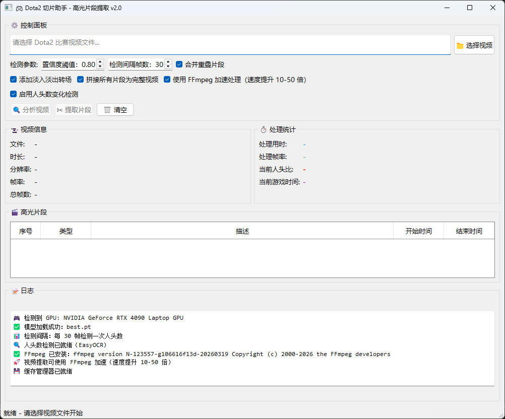
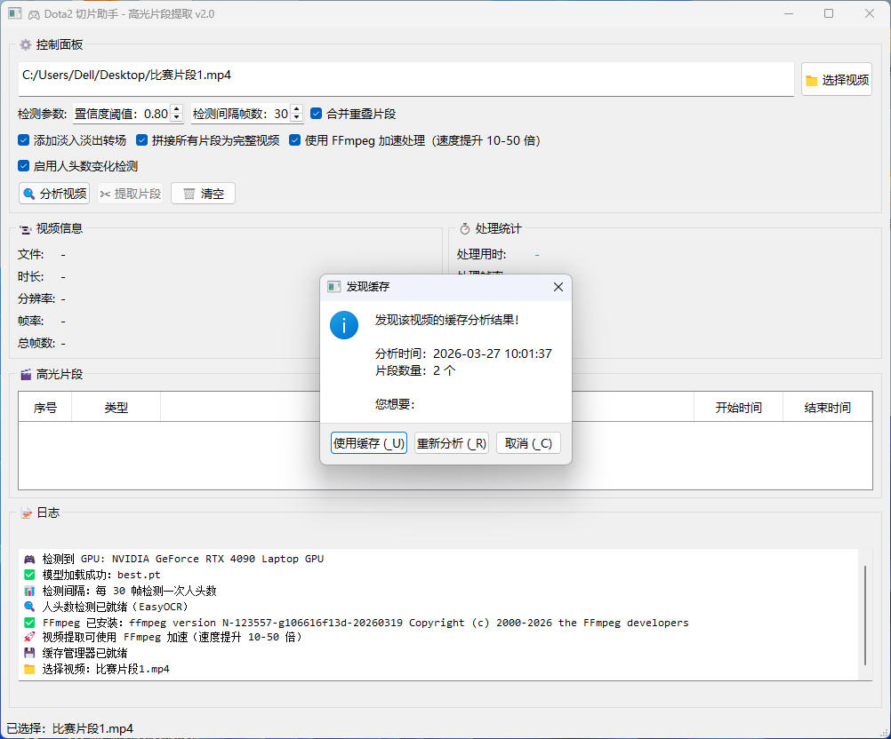
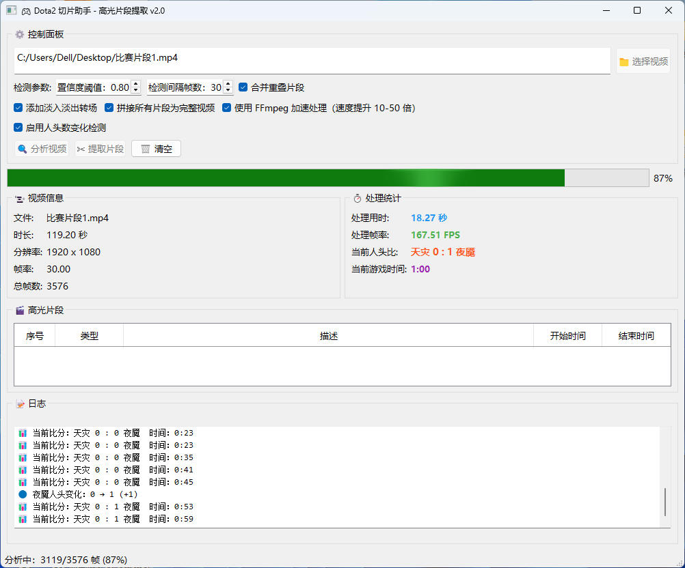

# Dota2 高光片段自动剪辑助手

<div align="center">

🎮 基于 AI 的 Dota2 游戏视频高光片段自动检测与剪辑工具

[](https://www.python.org/)
[](https://pytorch.org/)
[](https://github.com/ultralytics/ultralytics)
[](LICENSE)

</div>

---

## 📖 项目简介

**Dota2 高光片段自动剪辑助手** 是一款智能视频处理工具，能够自动分析 Dota2 游戏录像，识别并提取精彩高光片段。通过结合 **YOLOv8 目标检测** 和 **EasyOCR 文字识别** 技术，自动检测开雾、人头变化、胜利时刻等关键事件，让您快速生成精彩集锦。

### ✨ 主要功能

- 🎯 **智能事件检测** - 自动识别开雾、人头变化、胜利画面等关键事件
- 📊 **实时比分识别** - 使用 OCR 技术实时追踪游戏人头数和比赛时间
- ✂️ **自动片段提取** - 根据检测到的事件自动裁剪高光片段
- 🎬 **视频拼接** - 支持将多个片段拼接为完整集锦
- 🔄 **智能过滤** - 自动跳过回放、暂停等无效画面
- 💾 **缓存管理** - 支持分析结果缓存，避免重复处理
- 🖥️ **图形界面** - 友好的 PyQt5 图形界面，操作简单直观

---

## 🚀 快速开始

### 环境要求

- Python 3.8 或更高版本
- Windows 10/11
- NVIDIA GPU（推荐，用于加速推理）

### 安装步骤

1. **克隆或下载项目**
   ```bash
   cd dota2-clip-assistant
   ```

2. **创建虚拟环境**（推荐）
   ```bash
   python -m venv .venv
   .venv\Scripts\activate
   ```

3. **安装依赖**
   ```bash
   pip install -r requirements.txt
   ```

4. **下载模型和测试视频**

   **百度网盘下载：**
   - 链接：https://pan.baidu.com/s/18yEmXvE86tdvaNustJ4Orw
   - 提取码：关注下方公众号，回复`dota2切片助手`即可获得提取码
   - 包含内容：
     - `model/best.pt` - YOLOv8 检测模型（必需）
     - `videos/` - 测试视频文件（可选）

   将下载的 `best.pt` 模型文件放置在 `model/` 目录下

5. **运行程序**
   ```bash
   python main.py
   ```

---

## 📦 资源下载

| 资源 | 下载方式 | 说明 |
|------|---------|------|
| YOLOv8 模型 | 百度网盘 | 必需，约 50MB |
| 测试视频 | 百度网盘 | 可选，用于测试功能 |
| FFmpeg | [官网下载](https://ffmpeg.org/download.html) | 可选，加速视频处理 |


---

## 📋 使用说明

### 基本流程

1. **选择视频** - 点击"选择视频"按钮，选择 Dota2 游戏录像文件
2. **分析视频** - 点击"开始分析"，程序将自动检测高光事件
3. **查看结果** - 分析完成后，可在列表中查看所有检测到的片段
4. **提取片段** - 点击"提取片段"，生成独立的高光视频文件
5. **拼接视频**（可选）- 勾选"拼接所有片段"，生成完整集锦

### 📸 软件截图

<div align="center">

**图 1：软件启动界面**



**图 2：加载历史缓存**



**图 3：显示时间人头**



</div>

### 功能选项

| 选项 | 说明 |
|------|------|
| 人头数检测 | 启用 OCR 识别比分区域，检测人头变化事件 |
| 添加淡入淡出 | 为提取的片段添加转场效果 |
| 拼接所有片段 | 将所有高光片段合并为一个完整视频 |
| 检测间隔 | OCR 检测间隔帧数（值越大处理越快，但可能漏检） |

### 支持检测的事件类型

| 事件类型 | 说明 | 片段时长 |
|----------|------|----------|
| 🌫️ 开雾时刻 | 检测到开雾行为 | 前 5 秒 + 后 10 秒 |
| ⚔️ 人头变化 | 检测到人头数增加 | 前 20 秒 + 后 10 秒 |
| 🏆 决胜时刻 | 检测到胜利画面 | 前 10 秒 + 后 30 秒 |
| 📺 比赛回放 | 自动跳过 | - |
| ⏸️ 比赛暂停 | 自动跳过 | - |

---

## 🛠️ 技术架构

### 核心模块

```
dota2-clip-assistant/
├── main.py              # 程序入口
├── main_window.py       # PyQt5 图形界面
├── clip_detector.py     # 高光片段检测核心逻辑
├── score_ocr.py         # OCR 人头数识别模块
├── cache_manager.py     # 缓存管理模块
├── config.json          # 配置文件
└── model/
    └── best.pt          # YOLOv8 检测模型
```

### 技术栈

- **目标检测**: YOLOv8 - 检测比分区域、开雾、回放、暂停、胜利画面
- **文字识别**: EasyOCR - 识别比分区域的人头数和比赛时间
- **视频处理**: OpenCV + PyAV - 视频读取、剪辑、编码
- **图形界面**: PyQt5 - 跨平台 GUI 框架

### 智能校正机制

1. **人头数减少校验** - 人头数只能增加，识别到减少时自动校正
2. **时间连续性校验** - 比赛时间应单调递增，异常时采用预期值
3. **Replay/Paused 跳过** - 检测到回放/暂停时跳过处理，避免误识别
4. **缓冲期处理** - Replay 结束后增加 1 秒缓冲，避免画面切换误判

---

## 📁 项目结构

```
dota2-clip-assistant/
├── main.py                 # 程序入口
├── main_window.py          # 主窗口界面
├── clip_detector.py        # 片段检测器
├── score_ocr.py            # OCR 识别模块
├── cache_manager.py        # 缓存管理
├── analyze_score_video.py  # 比分识别测试脚本
├── test_clip.py            # 片段检测测试脚本
├── test_audio.py           # 音频测试脚本
├── config.json             # 配置文件
├── requirements.txt        # Python 依赖
├── README.md               # 项目说明
├── model/                  # 模型文件目录
│   └── best.pt
├── videos/                 # 视频文件目录
│   └── output/            # 输出文件目录
├── images/                 # 图片资源目录
└── cache/                  # 缓存文件目录
```

---

## ⚙️ 配置文件

`config.json` 配置文件说明：

```json
{
  "confidence_threshold": 0.8,    // YOLO 检测置信度阈值
  "detect_interval": 30,          // OCR 检测间隔帧数
  "use_gpu": true,                // 是否使用 GPU 加速
  "last_video_dir": "",           // 上次选择的视频目录
  "last_output_dir": ""           // 上次输出目录
}
```

---

## 🔧 常见问题

### Q: 处理速度慢怎么办？
- 启用 GPU 加速（需要 NVIDIA 显卡和 CUDA）
- 增大 OCR 检测间隔（如从 30 帧改为 60 帧）
- 降低视频分辨率后再处理

### Q: 人头数识别不准确？
- 确保比分区域清晰可见
- 调整检测置信度阈值
- 检查模型是否正确训练

### Q: 提取的视频没有声音？
- 确保原视频包含音频轨道
- 检查 PyAV 是否正确安装
- 尝试更新 `av` 库到最新版本

### Q: 拼接视频失败？
- 检查磁盘空间是否充足
- 确保所有片段文件完整
- 查看错误日志获取详细信息

---

## 📝 更新日志

### v3.0
- ✅ 添加 Victory 胜利画面检测
- ✅ 优化人头数识别校正逻辑
- ✅ 添加 Replay/Paused 状态跟踪和缓冲期处理
- ✅ 修复视频拼接音频时间戳问题
- ✅ 优化日志输出，支持 GUI 显示

### v2.0
- ✅ 添加 EasyOCR 人头数识别
- ✅ 支持缓存管理
- ✅ 优化片段提取逻辑

### v1.0
- ✅ 初始版本发布
- ✅ 基础 YOLOv8 检测功能

---

## 🤝 贡献

欢迎提交 Issue 和 Pull Request！

1. Fork 本项目
2. 创建特性分支 (`git checkout -b feature/AmazingFeature`)
3. 提交更改 (`git commit -m 'Add some AmazingFeature'`)
4. 推送到分支 (`git push origin feature/AmazingFeature`)
5. 开启 Pull Request

---

## 📄 许可证

本项目采用 MIT 许可证 - 查看 [LICENSE](LICENSE) 文件了解详情

---

## 🙏 致谢

- [YOLOv8](https://github.com/ultralytics/ultralytics) - 目标检测框架
- [EasyOCR](https://github.com/JaidedAI/EasyOCR) - OCR 文字识别
- [OpenCV](https://opencv.org/) - 图像处理库
- [PyAV](https://github.com/PyAV-Org/PyAV) - 视频编解码库
- [PyQt5](https://www.riverbankcomputing.com/software/pyqt/) - GUI 框架

---

## 📧 联系方式

如有问题或建议，请通过以下方式联系：

- 提交 Issue
- 发送邮件至项目维护者
- 作者：Cherry
- 邮箱：irritablecherry@qq.com
- 项目地址：https://github.com/irritablecherry/dota2-clip-assistant
---

## 📱 关注我
- 如需获得商业授权请关注公众号联系作者

|                                        公众号                                         | 
|:----------------------------------------------------------------------------------:|
||

---

<div align="center">

**如果这个项目对您有帮助，请给一个 ⭐ Star！**

Made with ❤️ for Dota2 Players

</div>
